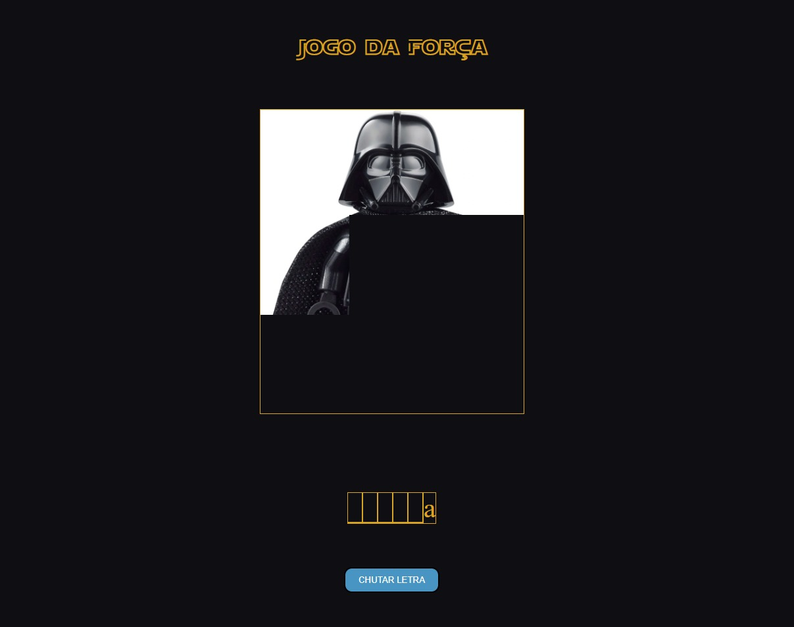

<h1 align="center"> Hangman Game </h1>

A basic development of a hangman game.

  <a href="#-technologies">Technologies</a>&nbsp;&nbsp;&nbsp;|&nbsp;&nbsp;&nbsp;
  <a href="#-project">Project</a>&nbsp;&nbsp;&nbsp;|&nbsp;&nbsp;&nbsp;
  <a href="#-site">Site</a>&nbsp;&nbsp;&nbsp;|&nbsp;&nbsp;&nbsp;
  <a href="#memo-license">License</a>

  

 

  

## 🛠️ Technologies

This project was developed with the following technologies:

- HTML and CSS
- JavaScript
- Git and Github

## 💻 Project

- With this website, inspired in Star Wars, you can play a random hangman game, with many diferent words.
- This website contain only portuguese words.
- If you find any bug, or want to improve the project, tell me!

## 🌐 Site

You can check the project with this link: https://hangman-game-psi.vercel.app

## :memo: License

This project is under the MIT license.

---

Check my others projects!👋
